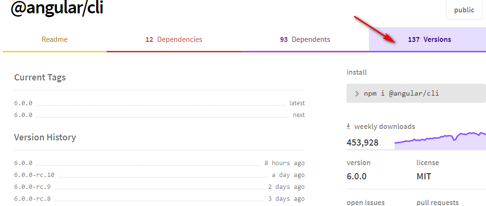

## angular-cli 构建工具 与 angular 版本的兼容情况

> 通过 npm 去 运行安装在本地的 angular-cli 而不是全局的 cli 来解决版本兼容的问题

1. 明确构建工具 兼容的angular的版本；

npm uninstall -g @angular/cli@wished.version.here

* angular 2.1 所兼容的 cli 版本

npm i angular-cli@1.0.0-beta.18 -g

* 将其安装到项目本地，而不是全局，利用npm 命令 去运行；

2. 快速查看 angular 与 angular-cli 的历史发布的版本

> 通过 npm 中进行查看，要比在github 中查看的更加直观，但明显github中更加详细



3. 通过对比 angular 与 @angular/cli 的版本发布时间，来思考两者之间的兼容性；

> The princple is simple, just see @angular/platform-server@2.1.0's release date , then go to angular-cli npm version page, to find the spec verison which is  related to above data; At least it can run the spec version angular;


4. through `npm install angular-cli@1.0.0-beta.18 --save-dev` comand install old spec version angular-cli to project local node_modules;

> note must be -dev model

5. custom package.json file to config npm commant  `"serve": "ng serve"`, and run the command in the terminal;

>  note you must add `run` keyword , when you run the custome npm script,eg. `npm run serve` 


```js
formErrors = {
    name: '',
    username: '',
    addresses: [
      { city: '', country: '' }
    ]
  };
  validationMessages = {
    name: {
      required: 'Name is required.',
      minlength: 'Name must be 3 characters.',
      maxlength: 'Name can\'t be longer than 6 characters.'
    },
    username: {
      required: 'Username is required.',
      minlength: 'Username must be 3 characters.'
    },
    addresses: {
      city: {
        required: 'City is required.',
        minlength: 'City must be 3 characters.'
      },
      country: {
        required: 'Country is required.'
      }
    }
  };

// now we've moved a lot of information 

```


The cli no longer supports creating new projects with ng2 since ng4 is out. This does not mean that it stopped supporting it though you can still build and serve your applications just like before but ng new will always be on the latest major release.

@dannypule no, you can still install latest version, but have to manually fall back Angular module versions in package.json after ng new. Yet I don't like this forced.
